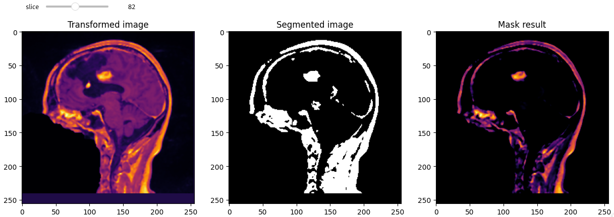
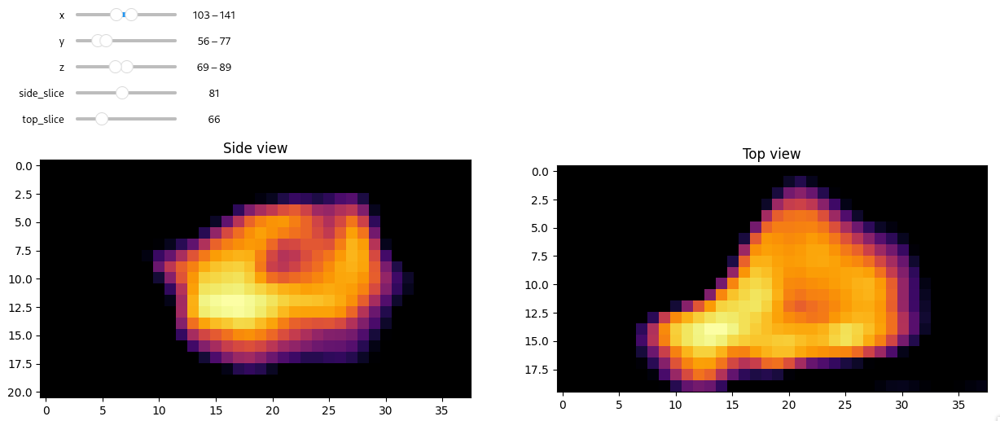
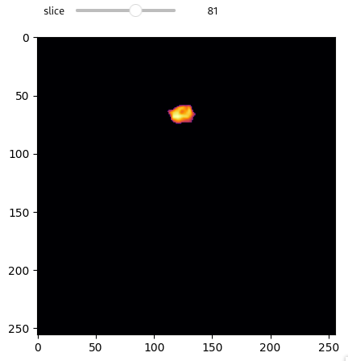
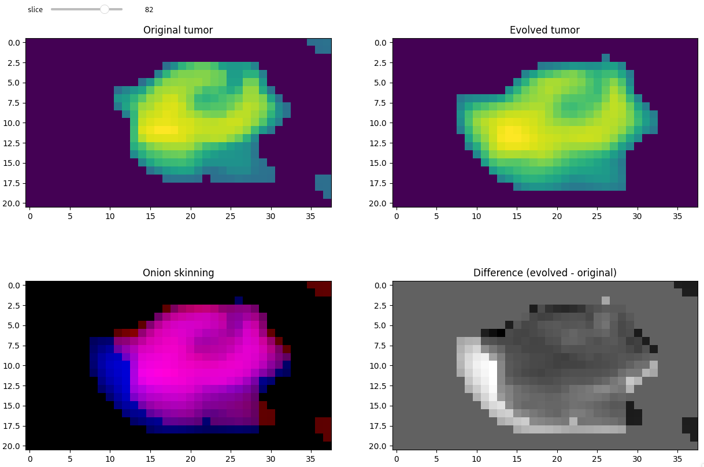

# vitk_project

### Raphaël Duhen, Maël Conan, Nigel Andrews

Dans ce document, nous allons présenter notre implémentation du projet, les difficultés rencontrées, ainsi que les divers résultats.

Nous avons également implémenté le projet sur un VSC Share, ce qui fait que les contributions de tout le monde n'apparaissent pas dans l'historique GIT, mais tout le monde a bel et bien participé au projet.

## Recalage d'image

### Pre-traitements

Avant de commencer le recalage, nous avons effectué plusieurs pre-traitements afin de pouvoir avoir des images plus propres et donc plus facilement recalables.

Nous avons donc effectué les pre-traitements suivants :
- itk.median_image_filter : permet de supprimer les bruits de l'image
- itk.ResampleImageFilter : permet de redimensionner l'image afin d'avoir des images de même taille

### Approche initiale: transformation rigide

Dans un premier temps, nous sommes parti sur une transformation rigide pour notre recalage d'image.
Cependant, nous nous sommes confrontés à un problème : des rotations non désirées intervenaient dans le processus de transformation.

La solution était donc toute trouvée : nous avons utilisé une transformation limitée à la translation.
Après plusieurs recherches, un des possibles problèmes était la transformation rigide. Nous nous sommes donc dirigés vers un autre type de transformation.

### Approche finale: transformation par translation

Avec ce type de transformation notre probleme de rotation de l'image pendant la transformation disparaît.

Notre recalage utilise les éléments suivants:
- un optimiseur : itk.RegularStepGradientDescentOptimizerv4
- une métrique  : itk.MeanSquaresImageToImageMetricv4

### Visualisation

Pour mieux visualiser les différentes étapes, nous avons ajouté des plots avec sliders afin de pouvoir visualiser les différentes tranches.

- Fixed image : image de base sans recalage
- Moving image : image sur laquelle on veut se recaler
- Transformed image : image recalée

## Segmentation

### Approche initiale: segmentation par seuillage automatique

Dans un premier temps, nous avons implémenté une segmentation par seuillage automatique. Cependant, déterminer un seuil convenable automatiquement prenait plus de temps que de le faire à la main.

Pour gagner du temps, nous avons donc décidé de nous diriger vers une autre approche.

### Approche finale: segmentation par seuillage manuel

L'approche finalement utilisée est une segmentation par seuillage manuel. En effet, avec ce type de segmentation, nous avons pu contourner les problèmes d'API puisque l'utilisation de la fonction itk.ConnectedThresholdIimageFilter n'a pas rencontré de problème.

Une fois ce seuil choisi, il ne restait plus qu'à l'utiliser en masque :

La dernière étape a consisté en une sélection manuelle d'une *bounding box* contenant la tumeur sur toutes les slices.

## Résultat

Nous obtenons à la fin une augmentation de volume de 13.1% et une augmentation de l'intensité des voxels de 10.9%.

