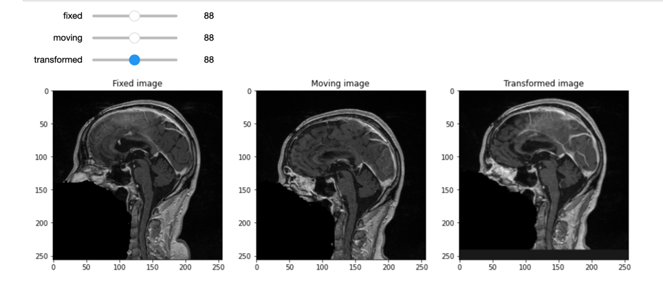
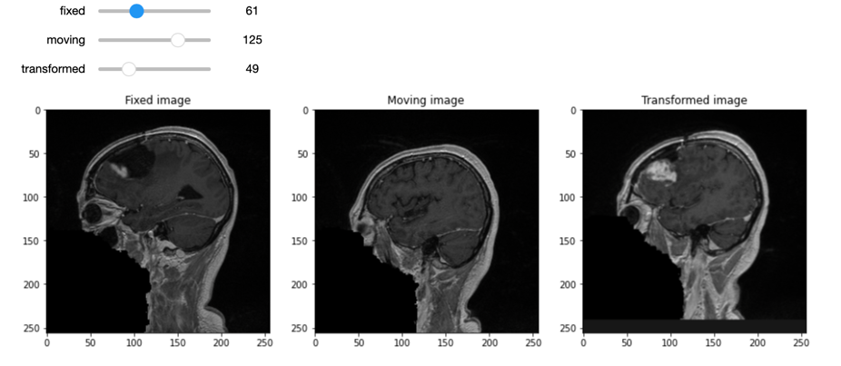
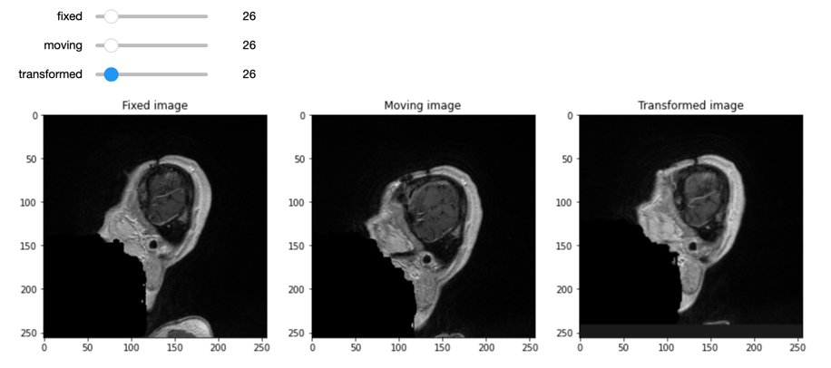

# vitk_project

### Raphaël Duhen, Maël Conan, Nigel Andrews

Dans ce document, nous allons présenter notre implémentation du projet, les difficultés rencontrées, ainsi que les divers résultats.

Nous avons également implémenté le projet sur un VSC Share, ce qui fait que les contributions de tout le monde n'apparaissent pas dans l'historique GIT, mais tout le monde a bel et bien participé au projet.

## Recalage d'image

### Approche initiale: transformation rigide

Dans un premier temps, nous sommes parti sur une transformation rigide pour notre recalage d'image.
Cependant, nous nous sommes confrontés à un problème : des rotations non désirées intervenaient dans le processus de transformation.

Après plusieurs recherches, un des possibles problèmes était la transformation rigide. Nous nous sommes donc dirigés vers un autre type de transformation.

### Approche finale: transformation par translation

L'approche finalement utilisée est une transformation par translation. En effet, avec ce type de transformation notre probleme de rotation de l'image pendant la transformation.

Egalement, pour atteindre tout cela, nous utilisons une registration avec les étapes suivantes :
- un optimizer : itk.RegularStepGradientDescentOptimizerv4
- des metrics: itk.MeanSquaresImageToImageMetricv4
- et enfin un registration: itk.ImageRegistrationMethodv4

### Illustration

Pour illustrer notre recalage, nous avons ajouté des sliders interactifs afin de pouvoir visualiser les différentes tranches.

Nous avons 3 sliders et donc 3 images :
- Fixed image : image de base sans recalage
- Moving image : image sur laquelle on veut se recaler
- Transformed image : image recalée

Voici donc plusieurs exemples de ces images :

## Segmentation